<h2>Tensorflow-Tiled-Image-Segmentation-Augmented-BCNB (2024/08/27)</h2>

This is the first experiment of Tiled Image Segmentation for <a href="https://bcnb.grand-challenge.org/Dataset/">BCNB Dataset</a>
 based on
the <a href="https://github.com/sarah-antillia/Tensorflow-Image-Segmentation-API">Tensorflow-Image-Segmentation-API</a>, and
<a href="https://drive.google.com/file/d/1h5c1UeHNZmcqfvnym9bxmDhtYaao94G8/view?usp=sharing">
Tiled-BCNB-ImageMask-Dataset-V2.zip</a>, which was derived by us from <a href="https://bcnb.grand-challenge.org/Dataset/">BCNB Dataset</a>
 
 
Please see also   
<a href="https://github.com/sarah-antillia/Tiled-ImageMask-Dataset-BCNB">
Tiled-ImageMask-Dataset-BCNB</a>  

In this experiment, we employed the following strategy:
<b>
 
1. We trained and validated a TensorFlow UNet model using the Tiled-BCNB-ImageMask-Dataset for BrightField Weak Boundary, 
which was tiledly-splitted to 512x512
 and reduced to 512x512 image and mask dataset. 
2. We applied the Tiled-Image Segmentation inference method to predict the tumoe regions for the mini_test images 
with a resolution of 2K or 4K pixels.  
</b>

   

<b>Actual Tiled Image Segmentation for Images of 2K and 4K pixels</b> 
As shown below, the tiled inferred masks don't look similar to the ground truth masks.  
<!--
<b>TO DO to improve segmentation accuracy:</b> 
Change model or training parameters for our Segmentation model. 
Use more sophiscated Segmentation model. 
-->
<table>
<tr>
<th>Input: image</th>
<th>Mask (ground_truth)</th>
<th>Prediction: tiled inferred_mask</th>
</tr>
<tr>
<td></td>
<td></td>
<td></td>
</tr>

<tr>
<td></td>
<td></td>
<td>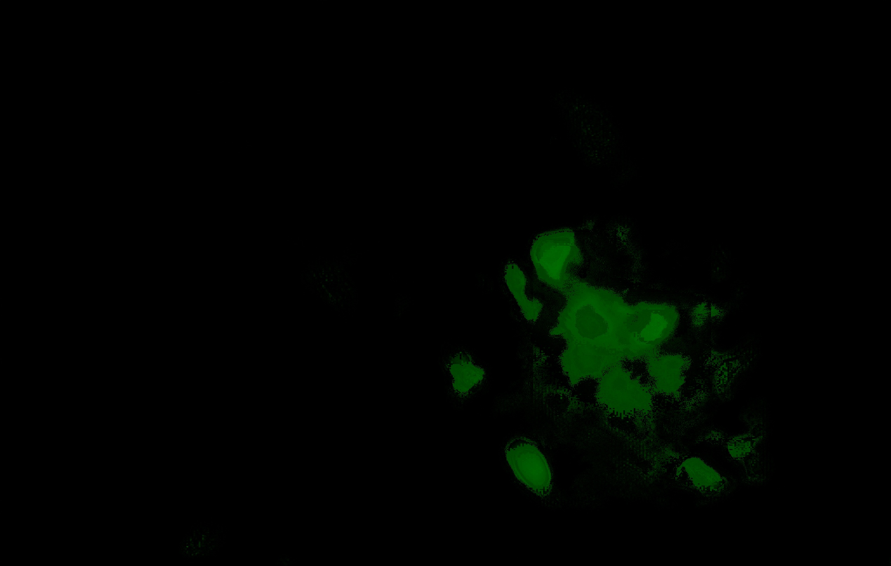</td>
</tr>

<tr>
<td></td>
<td></td>
<td>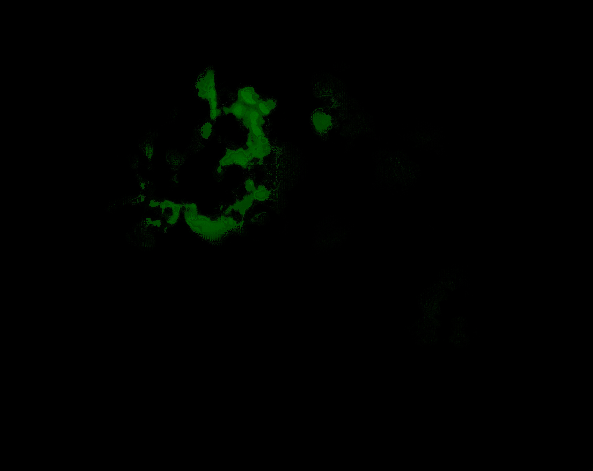</td>
</tr>

</table>

 
In this experiment, we used the simple UNet Model 
<a href="./src/TensorflowUNet.py">TensorflowSlightlyFlexibleUNet</a> for this BCNB Segmentation Model. 
As shown in <a href="https://github.com/sarah-antillia/Tensorflow-Image-Segmentation-API">Tensorflow-Image-Segmentation-API</a>.
you may try other Tensorflow UNet Models: 

<li><a href="./src/TensorflowSwinUNet.py">TensorflowSwinUNet.py</a></li>
<li><a href="./src/TensorflowMultiResUNet.py">TensorflowMultiResUNet.py</a></li>
<li><a href="./src/TensorflowAttentionUNet.py">TensorflowAttentionUNet.py</a></li>
<li><a href="./src/TensorflowEfficientUNet.py">TensorflowEfficientUNet.py</a></li>
<li><a href="./src/TensorflowUNet3Plus.py">TensorflowUNet3Plus.py</a></li>
<li><a href="./src/TensorflowDeepLabV3Plus.py">TensorflowDeepLabV3Plus.py</a></li>

 

<h3>1. Dataset Citation</h3>
The original dataset used here was taken from the following web-site 
<a href="https://bcnb.grand-challenge.org/Dataset/">Early Breast Cancer Core-Needle Biopsy WSI (BCNB) </a>
 
 
<b>BCNB Dataset</b> 
The dataset of Early Breast Cancer Core-Needle Biopsy WSI (BCNB) includes core-needle biopsy whole slide images (WSIs) 
of early breast cancer patients and the corresponding clinical data.
<a href="https://www.frontiersin.org/journals/oncology/articles/10.3389/fonc.2021.759007/full">
<b>
Predicting Axillary Lymph Node Metastasis in Early Breast Cancer Using Deep Learning on Primary Tumor Biopsy Slides
</b>
</a>.

<b>
Please note that the dataset is only used for education and research, and the usage for commercial and clinical applications is not allowed.
</b> 
  
<b>Annotation</b> 
Annotation information is stored in .json with the following format, where "vertices" 
have recorded coordinates of each point in the polygonal annotated area.
 
 

<b>License</b> 
This dataset is made freely available to academic and non-academic entities for non-commercial purposes such as academic research, teaching, scientific publications, or personal experimentation. Permission is granted to use the data given that you agree to our license terms bellow:

That you include a reference to the dataset in any work that makes use of the dataset. For research papers, cite our preferred publication as listed on our website; for other media cite our preferred publication as listed on our website or link to the website.
That you do not distribute this dataset or modified versions. It is permissible to distribute derivative works in as far as they are abstract representations of this dataset (such as models trained on it or additional annotations that do not directly include any of our data).
That you may not use the dataset or any derivative work for commercial purposes as, for example, licensing or selling the data, or using the data with a purpose to procure a commercial gain.
That all rights not expressly granted to you are reserved by us.
 
 
@article{xu2021predicting,
title={Predicting Axillary Lymph Node Metastasis in Early Breast Cancer Using Deep Learning on Primary Tumor Biopsy Slides},
author={Xu, Feng and Zhu, Chuang and Tang, Wenqi and Wang, Ying and Zhang, Yu and Li, Jie and Jiang, Hongchuan and Shi, Zhongyue and Liu, Jun and Jin, Mulan},
journal={Frontiers in Oncology},
pages={4133},
year={2021},
publisher={Frontiers}
}
 
 

<h3>
<a id="2">
2 Tiled-BCNB ImageMask Dataset
</a>
</h3>
 If you would like to train this Tiled-BCNB Segmentation model by yourself,
 please download the dataset from the google drive 
<a href="https://drive.google.com/file/d/1h5c1UeHNZmcqfvnym9bxmDhtYaao94G8/view?usp=sharing">
Tiled-BCNB-ImageMask-Dataset-V2.zip</a>
 
, expand the downloaded ImageMaskDataset and put it under <b>./dataset</b> folder to be
<pre>
./dataset
└─Tiled-BCNB
    ├─test
    │   ├─images
    │   └─masks
    ├─train
    │   ├─images
    │   └─masks
    └─valid
        ├─images
        └─masks
</pre>

<b>Tiled-BCNB Dataset Statistics</b> 
 
 
As shown above, the number of images of train and valid datasets is large enough to use for a training set for our segmentation model, 
but we used an online augmentation tool <a href="./src/ImageMaskAugmentor.py">ImageMaskAugmentor.py</a> 
to improve generalization performance.
 

 
<b>Train_images_sample</b> 
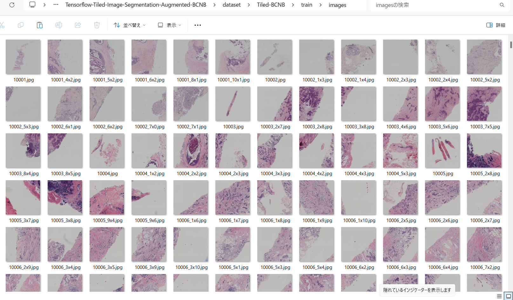
 
<b>Train_masks_sample</b> 

 

<h3>
3 Train TensorflowUNet Model
</h3>
 We have trained Tiled-BCNB TensorflowUNet Model by using the following
<a href="./projects/TensorflowSlightlyFlexibleUNet/Tiled-BCNB/train_eval_infer.config"> <b>train_eval_infer.config</b></a> file.  
Please move to ./projects/Tiled-BCNB and run the following bat file. 
<pre>
>1.train.bat
</pre>
, which simply runs the following command. 
<pre>
>python ../../../src/TensorflowUNetTrainer.py ./train_eval_infer.config
</pre>

<pre>
; train_eval_infer.config
; 2024/08/27 (C) antillia.com

[model]
model          = "TensorflowUNet"
generator      = True
image_width    = 512
image_height   = 512
image_channels = 3
input_normalize = False
normalization  = False
num_classes    = 1
base_filters   = 16
base_kernels   = (9,9)
num_layers     = 8
dropout_rate   = 0.05
learning_rate  = 0.00005
clipvalue      = 0.5
dilation       = (1,1)
;loss           = "bce_iou_loss"
loss           = "bce_dice_loss"
metrics        = ["dice_coef"]
show_summary   = False

[train]
epochs        = 100
batch_size    = 2
steps_per_epoch  = 320
validation_steps = 80
patience      = 10

;metrics       = ["iou_coef", "val_iou_coef"]
metrics       = ["dice_coef", "val_dice_coef"]

model_dir     = "./models"
eval_dir      = "./eval"
image_datapath = "../../../dataset/Tiled-BCNB/train/images/"
mask_datapath  = "../../../dataset/Tiled-BCNB/train/masks/"

epoch_change_infer     = True
epoch_change_infer_dir = "./epoch_change_infer"
epoch_change_tiledinfer     = True
epoch_change_tiledinfer_dir = "./epoch_change_tiledinfer"
num_infer_images       = 1

create_backup  = False

learning_rate_reducer = True
reducer_factor     = 0.3
reducer_patience   = 4
save_weights_only  = True

[eval]
image_datapath = "../../../dataset/Tiled-BCNB/valid/images/"
mask_datapath  = "../../../dataset/Tiled-BCNB/valid/masks/"

[test] 
image_datapath = "../../../dataset/Tiled-BCNB/test/images/"
mask_datapath  = "../../../dataset/Tiled-BCNB/test/masks/"

[infer] 
images_dir    = "./mini_test/images"
output_dir    = "./mini_test_output"

[tiledinfer] 
overlapping   = 64
images_dir    = "./mini_test/images"
output_dir    = "./mini_test_output_tiled"

[segmentation]
colorize      = True
black         = "black"
white         = "green"
blursize      = None

[image]
color_converter = None
;color_converter = "cv2.COLOR_BGR2HSV_FULL"
gamma           = 0
sharpening      = 0

[mask]
blur      = False
blur_size = (3,3)
binarize  = False
;threshold = 128
threshold = 80

[generator]
debug        = False
augmentation = True

[augmentor]
vflip    = True
hflip    = True
rotation = True
angles   = [90, 180, 210, 270, ]
shrinks  = [0.8,]
shears   = [0.1]

deformation = True
distortion  = True
sharpening  = False
brightening = False
barrdistortion = True

[deformation]
alpah     = 1300
sigmoids  = [8.0,]

[distortion]
gaussian_filter_rsigma= 40
gaussian_filter_sigma = 0.5
distortions           = [0.02, ]

[barrdistortion]
radius = 0.3
amount = 0.3
centers =  [(0.3, 0.3), (0.7, 0.3), (0.5, 0.5), (0.3, 0.7), (0.7, 0.7)]

[sharpening]
k        = 1.0

[brightening]
alpha  = 1.2
beta   = 10  
</pre>

<b>Model parameters</b> 
Defined a small <b>base_filters</b> and large <b>base_kernels</b> for the first Conv Layer of Encoder Block of 
<a href="./src/TensorflowUNet.py">TensorflowUNet.py</a> 
and a large num_layers (including a bridge between Encoder and Decoder Blocks).
<pre>
[model]
base_filters   = 16
base_kernels   = (9,9)
num_layers     = 8
</pre>

<b>Learning rate</b> 
Defined a small learning rate.  
<pre>
[model]
learning_rate  = 0.00005
</pre>

<b>Online augmentation</b> 
Enabled our online augmentation.  
<pre>
[model]
model         = "TensorflowUNet"
generator     = True
</pre>

<b>Loss and metrics functions</b> 
Specified "bce_dice_loss" and "dice_coef". 
<pre>
[model]
loss           = "bce_dice_loss"
metrics        = ["dice_coef"]
</pre>
<b>Learning rate reducer callback</b> 
Enabled learing_rate_reducer callback, and a small reducer_patience.
<pre> 
[train]
learning_rate_reducer = True
reducer_factor     = 0.3
reducer_patience   = 4
</pre>
<b>Early stopping callback</b> 
Enabled early stopping callback with patience parameter.
<pre>
[train]
patience      = 10
</pre>

<b>Epoch change inference callbacks</b> 
Enabled epoch_change_infer and epoch_change_tiledinfer callbacks. 
<pre>
[train]
epoch_change_infer       = True
epoch_change_infer_dir   =  "./epoch_change_infer"
epoch_change_tiledinfer  = True
epoch_change_tiledinfer_dir = "./epoch_change_tiledinfer"
num_infer_images         = 1
</pre>

By using these callbacks, on every epoch_change, the inference procedures can be called
 for an image in <b>mini_test</b> folder. These will help you confirm how the predicted mask changes 
 at each epoch during your training process.    

<b>Epoch_change_inference output</b> 
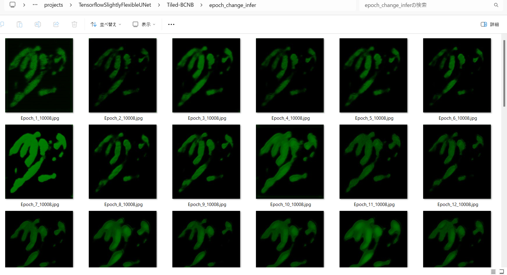 
 
 
<b>Epoch_change_tiled_inference output</b> 
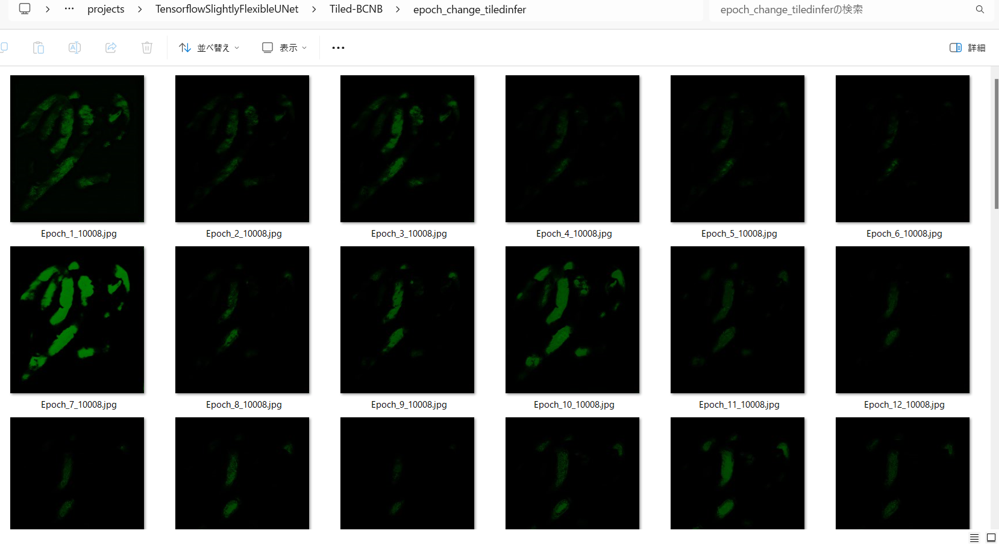 
 
 
In this experiment, the training process was stopped at epoch 46 by EarlyStopping Callback.  
 
 

 
<a href="./projects/TensorflowSlightlyFlexibleUNet/Tiled-BCNB/eval/train_metrics.csv">train_metrics.csv</a> 
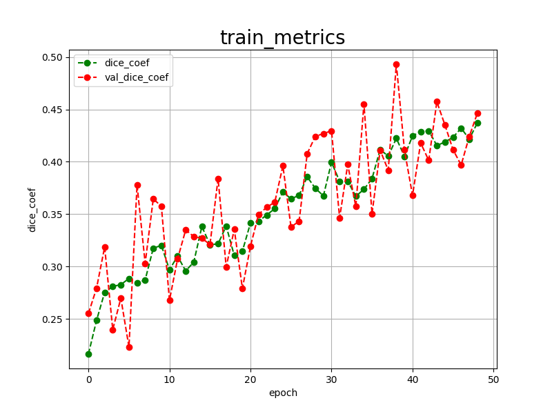 

 
<a href="./projects/TensorflowSlightlyFlexibleUNet/Tiled-BCNB/eval/train_losses.csv">train_losses.csv</a> 
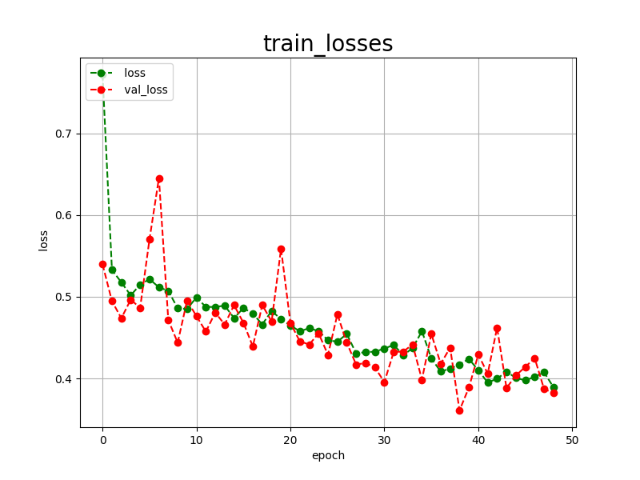 

 

<h3>
4 Evaluation
</h3>
Please move to a <b>./projects/TensorflowSlightlyFlexibleUNet/Tiled-BCNB</b> folder, 
and run the following bat file to evaluate TensorflowUNet model for Tiled-BCNB. 
<pre>
./2.evaluate.bat
</pre>
This bat file simply runs the following command.
<pre>
python ../../../src/TensorflowUNetEvaluator.py ./train_eval_infer_aug.config
</pre>

Evaluation console output: 

  

<a href="./projects/TensorflowSlightlyFlexibleUNet/Tiled-BCNB/evaluation.csv">evaluation.csv</a> 

The loss (bce_dice_loss) and dice_coef to this Tiled-BCNB/test were poor results. 
This simple UNet Model <a href="./src/TensorflowUNet.py">TensorflowSlightlyFlexibleUNet</a> 
 failed to achieve the desired accuracy.
We might change some parameters of our train_eval_infer.config file, or use other sophiscated UNet models 
to improve segmentation accuracy. 
<pre>
loss,0.4462
dice_coef,0.384
</pre>

<h3>
5 Inference
</h3>
Please move to a <b>./projects/TensorflowSlightlyFlexibleUNet/Tiled-BCNB</b> folder 
,and run the following bat file to infer segmentation regions for images by the Trained-TensorflowUNet model for Tiled-BCNB. 
<pre>
./3.infer.bat
</pre>
This simply runs the following command.
<pre>
python ../../../src/TensorflowUNetInferencer.py ./train_eval_infer_aug.config
</pre>

<b>mini_test_images</b> 
 
<b>mini_test_mask(ground_truth)</b> 
 

<b>Inferred test masks</b> 
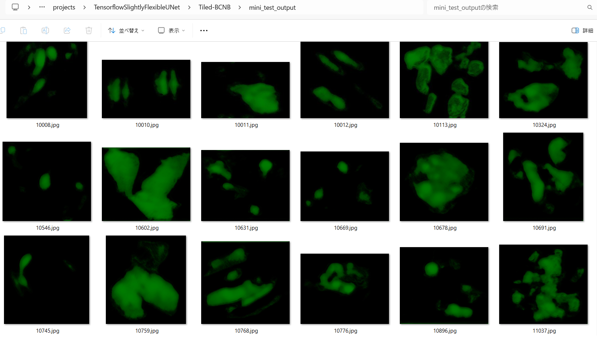 
 

<h3>
6 Tiled Inference
</h3>
Please move to a <b>./projects/TensorflowSlightlyFlexibleUNet/Tiled-BCNB</b> folder 
,and run the following bat file to infer segmentation regions for images by the Trained-TensorflowUNet model for Tiled-BCNB. 
<pre>
./4.tiled_infer.bat
</pre>
This simply runs the following command.
<pre>
python ../../../src/TensorflowUNetTiledInferencer.py ./train_eval_infer_aug.config
</pre>

<b>Tiled inferred test masks</b> 
 
 
<b>Enlarged images and masks </b> 

<table>
<tr>
<th>Image</th>
<th>Mask (ground_truth)</th>
<th>Tiled-inferred-mask</th>
</tr>

<tr>
<td></td>
<td></td>
<td></td>
</tr>

<tr>
<td></td>
<td></td>
<td></td>
</tr>

<tr>
<td></td>
<td></td>
<td>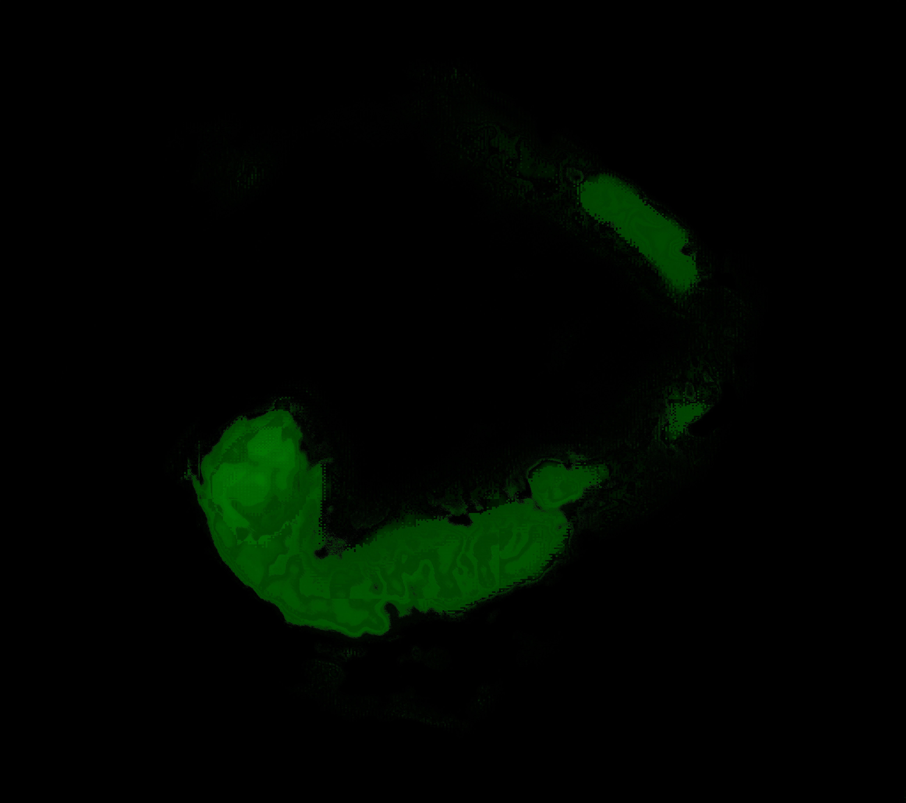</td>
</tr>
<tr>
<td></td>
<td></td>
<td></td>
</tr>
<tr>
<td></td>
<td></td>
<td></td>
</tr>

</table>

 
 
<!--
  -->
<b>Comparison of Non-tiled inferred mask and Tiled-Inferred mask</b> 
As shown below, both non-tiled and tiled inferred masks are far from the ground truth masks, 
but non-tiled inference can generate slightly better results than non-tiled inferencer.

 
<table>
<tr>
<th>Mask (ground_truth)</th>

<th>Non-tiled-inferred-mask</th>
<th>Tiled-inferred-mask</th>
</tr>
<tr>
<td></td>

<td></td>
<td>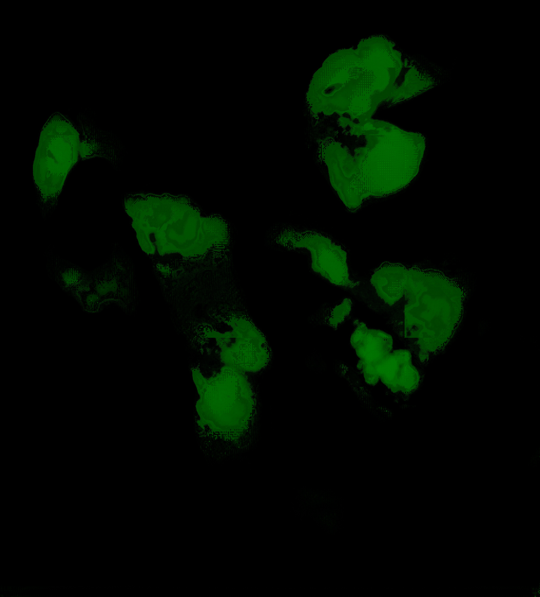</td>

</tr>
<tr>
<td></td>

<td></td>
<td>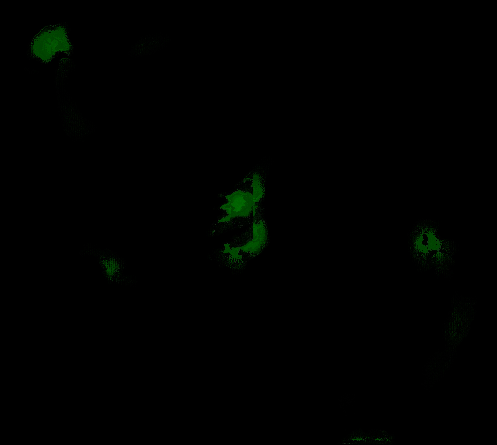</td>
</tr>
<tr>
<td></td>

<td></td>
<td></td>
</tr>
</table>
 

<h3>
References
</h3>
<b>1. Early Breast Cancer Core-Needle Biopsy WSI Dataset Motivation</b> 
@article{xu2021predicting,
  title={Predicting Axillary Lymph Node Metastasis in Early Breast Cancer Using Deep Learning on Primary Tumor Biopsy Slides},
  author={Xu, Feng and Zhu, Chuang and Tang, Wenqi and Wang, Ying and Zhang, Yu and Li, Jie and Jiang, Hongchuan and Shi, Zhongyue and Liu, Jun and Jin, Mulan},
  journal={Frontiers in Oncology},
  pages={4133},
  year={2021},
  publisher={Frontiers}
}
 
<a href="https://bcnb.grand-challenge.org/">https://bcnb.grand-challenge.org/</a>
 
 
<b>2. Tiled-ImageMask-Dataset-BNCB
</b> 
Toshiyuki Arai @antillia.com 
<a href="https://github.com/sarah-antillia/Tiled-ImageMask-Dataset-BCNB">
https://github.com/sarah-antillia/Tiled-ImageMask-Dataset-BCNB</a>
